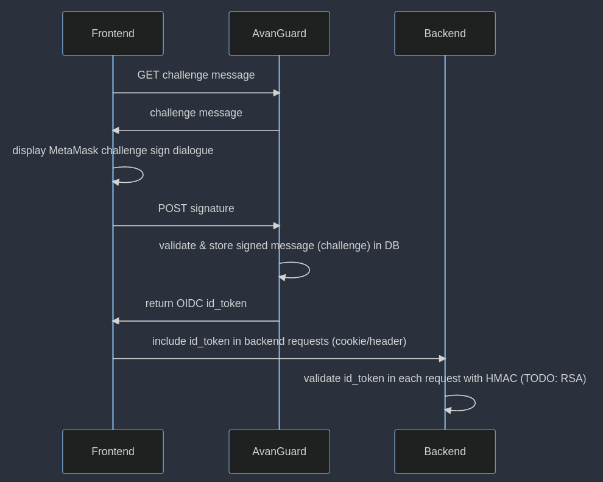

# AvanGuard OIDC identity service

## What is this?

Avanguard is a microservice performing OIDC-like registration/sign-in with a web3 wallet.

The repository contains 3 microservices:

- **avanguard**: provides REST API allowing web3 message signing, validation and OIDC id token retrieval
- **web**: frontend application connecting the wallet, performing message signing and communicating with Avanguard and backend apis
- **backend**: emulates client backend application, validates the token with HMAC algorithm

## How does it work?



## How do I use it?

### Frontend

To obtain JWT token from Avanguard, you'll have to:

1. Get challenge message from `/auth/start` endpoint

```typescript
interface WalletChallengeRequest {
  address: string;
}

interface WalletChallenge {
  challenge: string;
}

const getWalletChallenge = (data: WalletChallengeRequest) =>
  client.post<WalletChallenge>(`auth/start`, data);
```

2. Display web3 wallet message sign dialogue for user to sign the challenge

```typescript

import { useSignTypedData } from 'wagmi';

const { signTypedDataAsync } = useSignTypedData();
const message = JSON.parse(data.challenge);
const types = message.types;
const domain = message.domain;
const value = message.message;
const signature = await signTypedDataAsync({ types, domain, value });
```

3. POST signature to `/auth` endpoint

```typescript
interface SignMessageRequest {
  address: string;
  signature: string;
  nonce: string;
}

interface LoginResponse {
  token: string;
}

const login = (data: SignMessageRequest) =>
  client.post<LoginResponse>(`auth`, data);
```

Response contains JWT token you can use for communication with your backend service.
It can be validated with HMAC algorithm by using the shared client secret.

### Configuration

Avanguard can be configured with command-line arguments or environment variables.

```
Usage: avanguard [OPTIONS]

Options:
      --issuer-url <ISSUER_URL>
          URL to be used as issuer in JWT token [env: AG_ISSUER_URL=] [default: http://localhost:8080]
      --client-id <CLIENT_ID>
          OIDC client id, shared with client application [env: AG_CLIENT_ID=] [default: client_id]
      --client-secret <CLIENT_SECRET>
          OIDC client secret, shared with client application to perform HMAC JWT validation [env: AG_CLIENT_SECRET=] [default: client_secret]
      --client-origin-url <CLIENT_ORIGIN_URL>
          Url from which client requests will come, used to set CORS header [env: AG_CLIENT_ORIGIN_URL=] [default: http://localhost:8000]
      --listen-port <LISTEN_PORT>
          REST API listen port [env: AG_LISTEN_PORT=] [default: 8080]
      --db-host <DB_HOST>
          Database host [env: AG_DB_HOST=] [default: localhost]
      --db-port <DB_PORT>
          Database port [env: AG_DB_PORT=] [default: 5432]
      --db-name <DB_NAME>
          Database name [env: AG_DB_NAME=] [default: avanguard]
      --db-user <DB_USER>
          Database user [env: AG_DB_USER=] [default: avanguard]
      --db-password <DB_PASSWORD>
          Database password [env: AG_DB_PASSWORD=avanguard] [default: ]
      --log-level <LOG_LEVEL>
          Log level [env: AG_LOG_LEVEL=] [default: INFO]
  -h, --help
          Print help
```

### Development setup

To run all services locally:

```bash
docker-compose up
```

To run frontend dev server separately:

```bash
cd web

# install pnpm if not installed yet
npm install -g pnpm

# install dependencies
pnpm install

# run dev server
pnpm run dev
```
